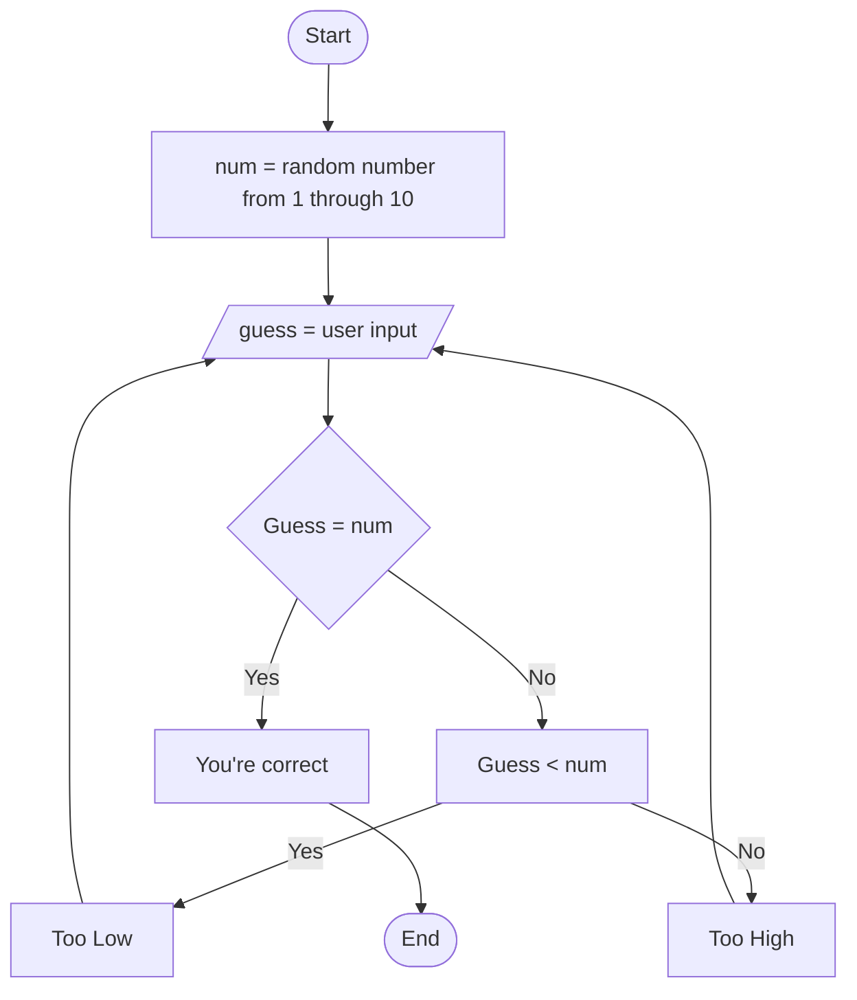

This flow chart is the explanation of a guessing game. The program starts by generating a random number between 1 and 10. The user is then prompted to guess what that number is. The program will check if the user's guess is the same as the random number, if yes, then you are congradulated and the program ends. If the user's guess is not correct, the program determines whether the user's guess was either too high or too low. It will give the user this feedback and allow them to guess a new number. This cycle will loop until the user guesses the correct number.